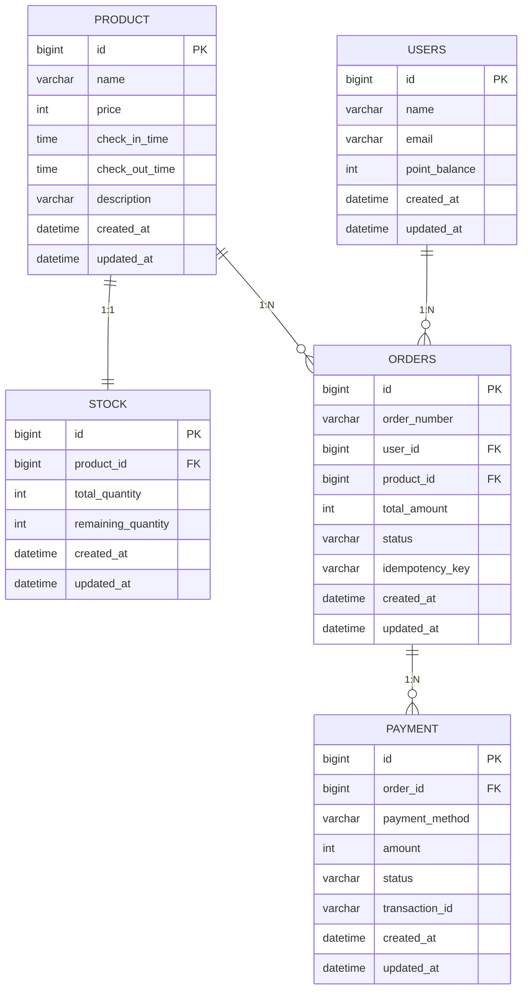
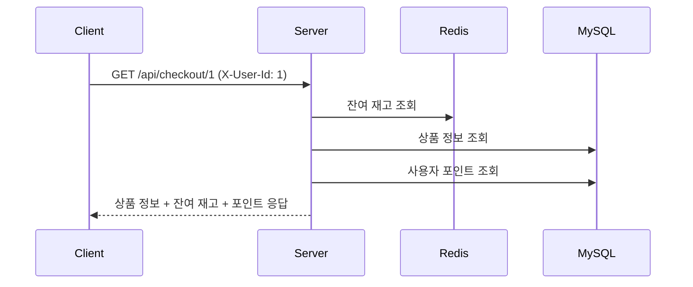
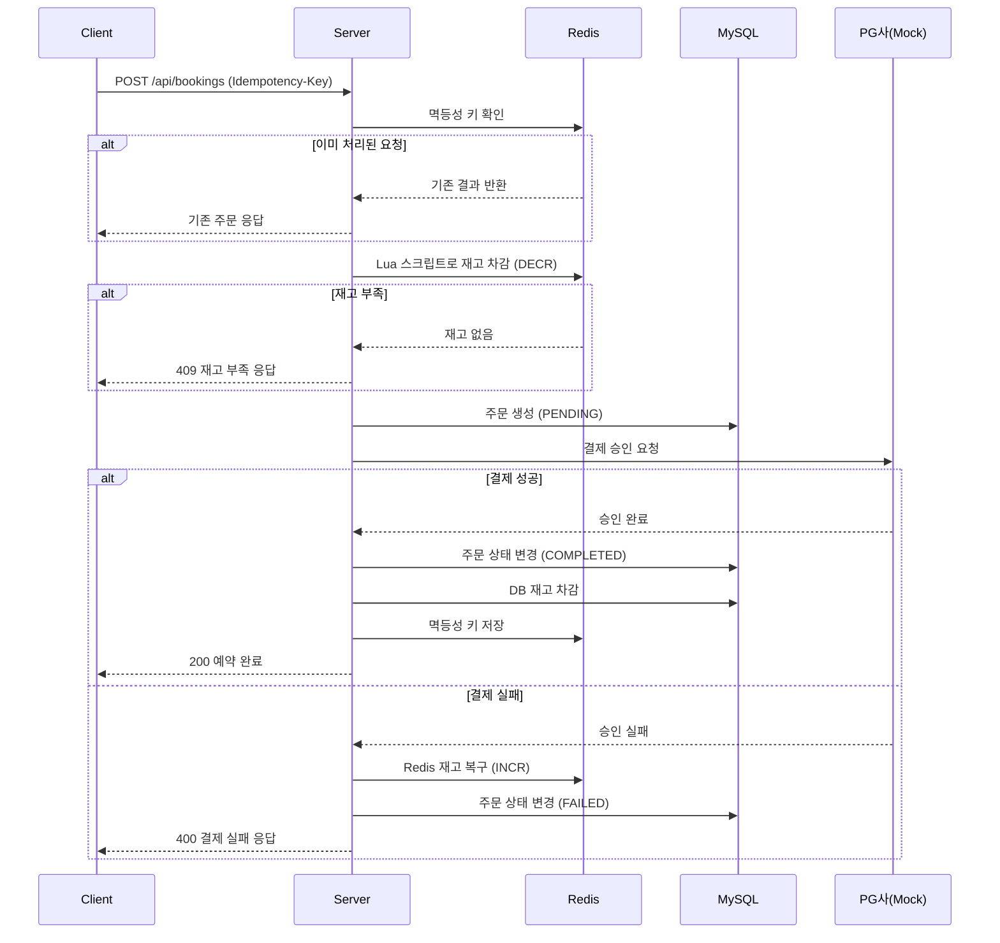
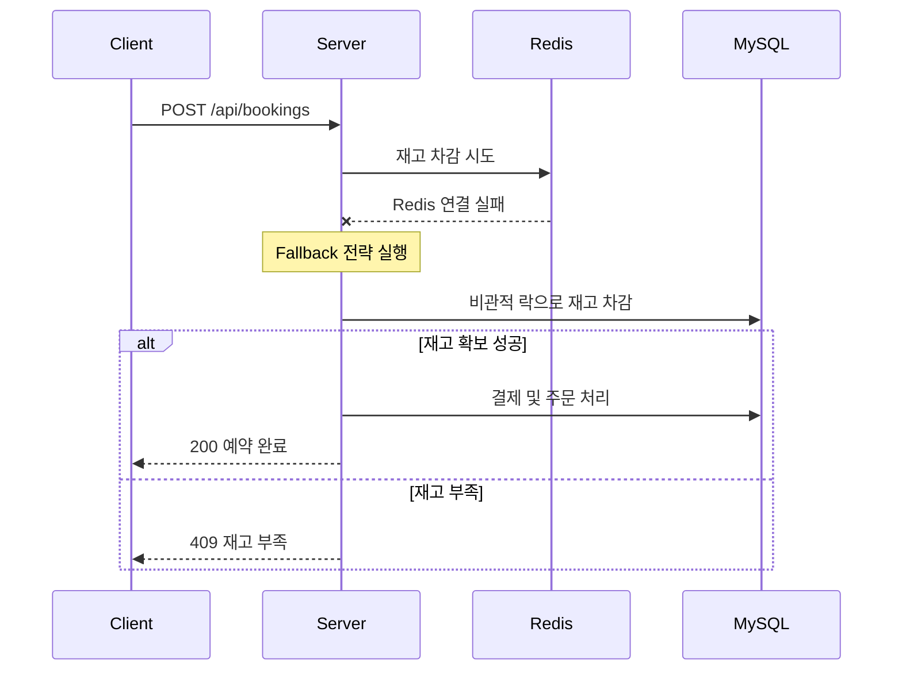

# 선착순 예약 결제 플랫폼

한정 수량 숙소 상품의 선착순 예약 및 결제를 처리하는 플랫폼입니다.
분산 서버 환경에서 동시성 제어, 결제 안정성, 장애 대응을 고려하여 설계하였습니다.

---

## 기술 스택

| 구분 | 기술 |
|------|------|
| Language | Java 17 |
| Framework | Spring Boot 3.3.3 |
| Database | MySQL 8.0 |
| Cache | Redis 7 |
| Build | Gradle |
| Infra | Docker Compose (MySQL, Redis) |
| Library | Spring Data JPA, Spring Data Redis, Resilience4j |

---

## 프로젝트 구조

```
src/main/java/com/reservation/
├── domain/
│   ├── product/             # 상품 도메인
│   │   ├── controller/
│   │   ├── dto/
│   │   ├── entity/
│   │   ├── repository/
│   │   └── service/
│   ├── stock/               # 재고 도메인
│   │   ├── entity/
│   │   ├── repository/
│   │   └── service/
│   ├── user/                # 사용자 도메인
│   │   ├── entity/
│   │   ├── repository/
│   │   └── service/
│   ├── order/               # 주문 도메인
│   │   ├── controller/
│   │   ├── dto/
│   │   ├── entity/
│   │   ├── repository/
│   │   └── service/
│   └── payment/             # 결제 도메인
│       ├── client/           # 외부 결제 클라이언트 (PG, Y페이)
│       ├── dto/
│       ├── entity/
│       ├── repository/
│       └── service/
│           └── strategy/    # 결제 수단별 Strategy
└── global/
    ├── common/
    │   ├── constants/        # 상수 (헤더 등)
    │   ├── dto/              # 공통 응답 포맷
    │   └── entity/           # BaseEntity
    ├── config/               # Redis, JPA, Web 설정
    ├── exception/            # 글로벌 예외 처리
    │   ├── code/             # ErrorCode enum
    │   └── handler/          # ExceptionHandler
    └── ratelimit/            # Rate Limiting
```

---

## 실행 방법

### 1. 사전 요구사항
- Java 17+
- Docker, Docker Compose

### 2. 인프라 실행
```bash
docker-compose up -d
```

### 3. 애플리케이션 실행
```bash
./gradlew bootRun
```

### 4. 분산 환경 테스트 (2대 서버)
```bash
# 서버 1 (8080 포트)
./gradlew bootRun --args='--server.port=8080'

# 서버 2 (8081 포트)
./gradlew bootRun --args='--server.port=8081'
```

---

## API 명세

> **인증/인가 참고사항**
>
> 본 프로젝트에서는 인증/인가 구현을 생략하였습니다.
> 실제 환경에서는 `Authorization` 헤더의 토큰으로 사용자를 식별하지만,
> 이를 대체하여 커스텀 헤더 `X-User-Id`로 사용자 ID를 직접 전달받는 방식을 사용합니다.

### 1. GET /api/checkout/products/{productId} - 주문서 진입

상품 정보 및 사용자의 가용 포인트를 조회합니다.

**Request**
```
GET /api/checkout/products/{productId}
X-User-Id: {userId}
```

**Response (200 OK)**
```json
{
  "productId": 1,
  "productName": "제주 오션뷰 스위트",
  "price": 50000,
  "checkInTime": "15:00",
  "checkOutTime": "11:00",
  "description": "제주도 오션뷰 스위트룸",
  "remainingStock": 7,
  "userPoint": 10000
}
```

### 2. POST /api/bookings - 결제 및 예약 완료

주문서 정보를 입력받아 결제를 진행하고 최종 주문을 생성합니다.

**Request**
```
POST /api/bookings
X-User-Id: {userId}
Idempotency-Key: {UUID}
Content-Type: application/json
```
```json
{
  "productId": 1,
  "payments": [
    {
      "method": "CREDIT_CARD",
      "amount": 40000
    },
    {
      "method": "Y_POINT",
      "amount": 10000
    }
  ]
}
```

**Response (200 OK)**
```json
{
  "orderId": 1,
  "orderNumber": "ORD-20260501-a3f2b1c4",
  "totalAmount": 50000,
  "orderStatus": "COMPLETED",
  "payments": [
    {
      "method": "CREDIT_CARD",
      "amount": 40000,
      "status": "APPROVED"
    },
    {
      "method": "Y_POINT",
      "amount": 10000,
      "status": "APPROVED"
    }
  ]
}
```

### 에러 응답

모든 에러는 동일한 형식으로 응답합니다.

```json
{
  "code": "STOCK001",
  "message": "재고가 부족합니다."
}
```

| HTTP 상태 | 에러 코드 | 설명 |
|-----------|----------|------|
| 400 | `PAYMENT002` | 포인트 부족 |
| 400 | `PAYMENT003` | 외부 결제 수단은 하나만 사용 가능 |
| 400 | `PAYMENT004` | 결제 한도 초과 |
| 404 | `PRODUCT001` | 상품을 찾을 수 없음 |
| 404 | `USER001` | 사용자를 찾을 수 없음 |
| 409 | `STOCK002` | 재고 부족 |
| 409 | `ORDER001` | 중복 요청 (멱등성 키) |
| 429 | `COMMON005` | 요청 횟수 초과 (Rate Limiting) |
| 500 | `PAYMENT001` | 결제 실패 |
| 500 | `COMMON000` | 서버 내부 오류 |
| 503 | `PAYMENT005` | 결제 요청 시간 초과 |
| 503 | `PAYMENT006` | 결제 서비스 일시 이용 불가 (서킷 오픈) |

---

## 시스템 아키텍처

```
┌─────────┐     ┌─────────┐
│ Client  │     │ Client  │
└────┬────┘     └────┬────┘
     │               │
     └───────┬───────┘
             │
     ┌───────▼───────┐
     │  Load Balancer │
     └───────┬───────┘
             │
     ┌───────┴───────┐
     │               │
┌────▼────┐    ┌────▼────┐
│ Server 1│    │ Server 2│
│ (:8080) │    │ (:8081) │
└────┬────┘    └────┬────┘
     │               │
     └───────┬───────┘
             │
     ┌───────┴───────┐
     │               │
┌────▼────┐    ┌────▼────┐
│  MySQL  │    │  Redis  │
│ (주문/결제)│    │ (재고/락) │
└─────────┘    └─────────┘
```

---

## ERD

> 상세 ERD, 테이블 명세 및 DDL 스크립트는 [docs/erd.md](docs/erd.md)에서 확인할 수 있습니다.



---

## 시퀀스 다이어그램

> 상세 시퀀스 다이어그램은 [docs/sequence-diagrams.md](docs/sequence-diagrams.md)에서 확인할 수 있습니다.

### Checkout API 플로우



### Booking API 플로우



### 장애 발생 시 플로우 (Redis 장애)


