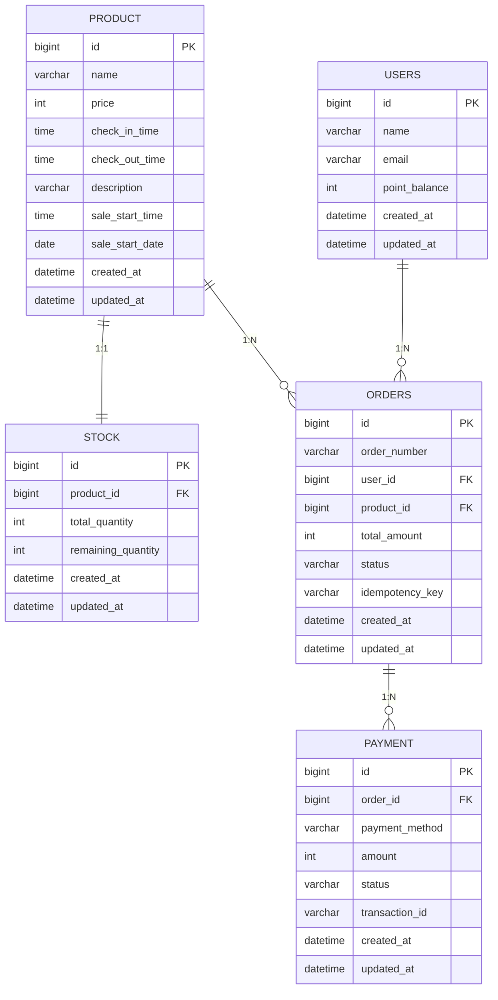
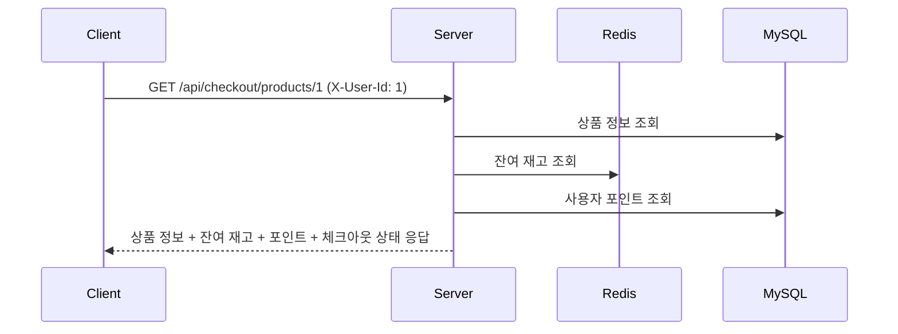
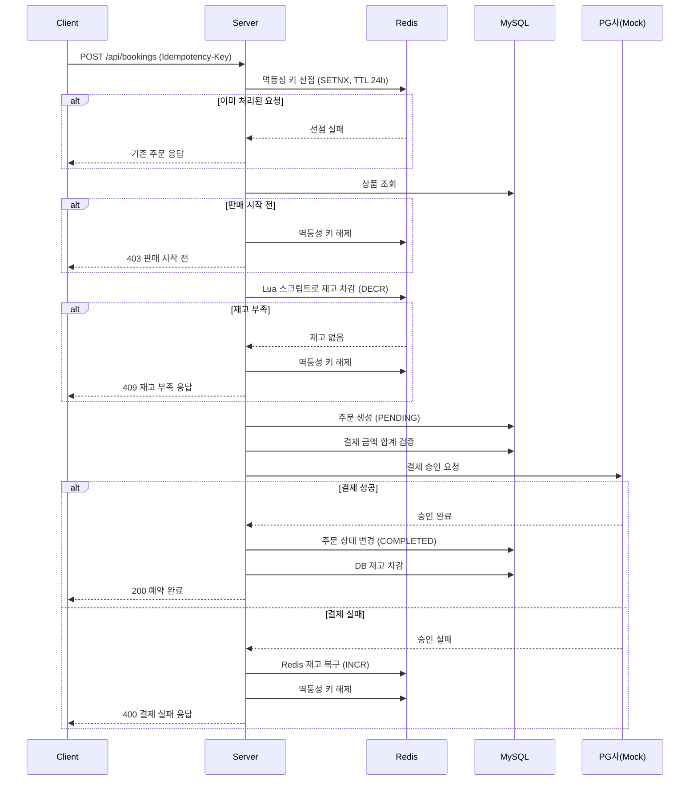
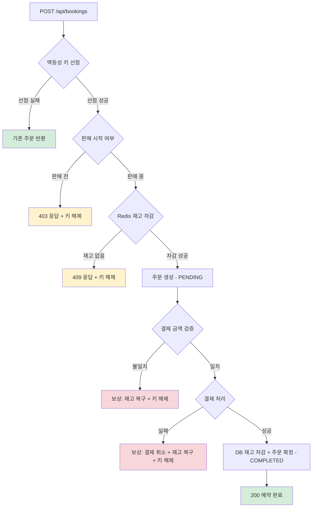

# 선착순 예약 결제 플랫폼

한정 수량 숙소 상품의 선착순 예약 및 결제를 처리하는 플랫폼입니다.
분산 서버 환경에서 동시성 제어, 결제 안정성, 장애 대응을 고려하여 설계하였습니다.

| 문서 | 설명 |
|------|------|
| [DECISIONS.md](DECISIONS.md) | 주요 기술적 쟁점과 선택 근거 |
| [docs/erd.md](docs/erd.md) | ERD, 테이블 명세 및 DDL 스크립트 |
| [docs/sequence-diagrams.md](docs/sequence-diagrams.md) | 상세 시퀀스 다이어그램 |
| [docs/AI_USAGE.md](docs/AI_USAGE.md) | AI 활용 기록 |

---

## 실행 방법

### 사전 요구사항
- Docker, Docker Compose

### 실행
```bash
docker compose up -d
```
> Nginx + Spring Boot 2대 + MySQL + Redis가 모두 실행됩니다.

### 종료 및 초기화
```bash
docker compose down -v
```

### API 테스트

Swagger UI에서 API를 직접 테스트할 수 있습니다.

```
http://localhost/swagger-ui/index.html
```

#### curl 예시

```bash
# Checkout API — 주문서 진입 (사용자 1, 상품 1)
curl -s http://localhost/api/checkout/products/1 \
  -H "X-User-Id: 1" | jq

# Booking API — 신용카드 단일 결제
curl -s -X POST http://localhost/api/bookings \
  -H "Content-Type: application/json" \
  -H "X-User-Id: 1" \
  -H "Idempotency-Key: $(uuidgen)" \
  -d '{"productId": 1, "payments": [{"method": "CREDIT_CARD", "amount": 150000}]}' | jq

# Booking API — 복합 결제 (카드 + 포인트)
curl -s -X POST http://localhost/api/bookings \
  -H "Content-Type: application/json" \
  -H "X-User-Id: 3" \
  -H "Idempotency-Key: $(uuidgen)" \
  -d '{"productId": 2, "payments": [{"method": "CREDIT_CARD", "amount": 100000}, {"method": "Y_POINT", "amount": 100000}]}' | jq
```

### 초기 데이터

`docker compose up` 시 아래 데이터가 자동으로 생성됩니다.

**상품**

| ID | 이름 | 가격 | 입실 | 퇴실 | 재고 |
|----|------|------|------|------|------|
| 1 | 제주 오션뷰 디럭스 | 150,000원 | 15:00 | 11:00 | 10개 |
| 2 | 서울 시티뷰 스위트 | 200,000원 | 15:00 | 11:00 | 10개 |
| 3 | 부산 해운대 프리미엄 | 180,000원 | 16:00 | 11:00 | 10개 |
| 4 | 강릉 경포 풀빌라 | 250,000원 | 15:00 | 11:00 | 10개 |
| 5 | 여수 마린뷰 패밀리 | 170,000원 | 15:00 | 12:00 | 10개 |

**사용자**

| ID | 이름 | 이메일 | 포인트 |
|----|------|--------|--------|
| 1 | 김철수 | kim@example.com | 100,000 |
| 2 | 이영희 | lee@example.com | 50,000 |
| 3 | 박민수 | park@example.com | 200,000 |
| 4 | 정수진 | jung@example.com | 0 |
| 5 | 최동욱 | choi@example.com | 300,000 |

### 테스트

```bash
./gradlew test
```

> 테스트 실행에는 Docker가 필요합니다 (Testcontainers 사용).

---

## 전체 구조

### 시스템 아키텍처

```
┌─────────┐     ┌─────────┐
│ Client  │     │ Client  │
└────┬────┘     └────┬────┘
     │               │
     └───────┬───────┘
             │
     ┌───────▼───────┐
     │  Nginx (:80)  │
     └───────┬───────┘
             │
     ┌───────┴───────┐
     │               │
┌────▼────┐    ┌────▼────┐
│Server 1 │    │Server 2 │
│ (:8080) │    │ (:8080) │
└────┬────┘    └────┬────┘
     │               │
     └───────┬───────┘
             │
     ┌───────┴───────┐
     │               │
┌────▼────┐    ┌────▼────┐
│  MySQL  │    │  Redis  │
│(주문/결제)│    │(재고/멱등성)│
└─────────┘    └─────────┘
```

### 기술 스택

| 구분 | 기술 |
|------|------|
| Language | Java 17 |
| Framework | Spring Boot 3.3.3 |
| Database | MySQL 8.0 |
| Cache | Redis 7 |
| Build | Gradle |
| Infra | Docker Compose (Nginx, MySQL, Redis) |
| Library | Spring Data JPA, Spring Data Redis, Resilience4j |

### 프로젝트 구조

```
src/main/java/com/reservation/
├── domain/
│   ├── product/             # 상품 도메인
│   │   ├── entity/
│   │   ├── repository/
│   │   └── service/
│   ├── stock/               # 재고 도메인
│   │   ├── entity/
│   │   ├── repository/
│   │   └── service/
│   ├── user/                # 사용자 도메인
│   │   ├── entity/
│   │   ├── repository/
│   │   └── service/
│   ├── order/               # 주문 도메인
│   │   ├── controller/
│   │   ├── dto/
│   │   ├── entity/
│   │   ├── repository/
│   │   └── service/
│   └── payment/             # 결제 도메인
│       ├── client/           # 외부 결제 클라이언트 (PG, Y페이)
│       ├── dto/
│       ├── entity/
│       ├── repository/
│       └── service/
│           └── strategy/    # 결제 수단별 Strategy
└── global/
    ├── common/
    │   ├── constants/        # 상수 (헤더 등)
    │   ├── dto/              # 공통 응답 포맷
    │   └── entity/           # BaseEntity
    ├── config/               # Redis, JPA, Web 설정
    ├── exception/            # 글로벌 예외 처리
    │   ├── code/             # ErrorCode enum
    │   └── handler/          # ExceptionHandler
    └── ratelimit/            # Rate Limiting
```

---

## API 명세

> **인증/인가 참고사항**
>
> 본 프로젝트에서는 인증/인가 구현을 생략하였으며,
> 커스텀 헤더 `X-User-Id`로 사용자 ID를 직접 전달받는 방식을 사용합니다.

### 1. GET /api/checkout/products/{productId} - 주문서 진입

상품 정보, 잔여 재고, 사용자의 가용 포인트 등을 조회합니다.

**Request**
```
GET /api/checkout/products/{productId}
X-User-Id: {userId}
```

**Response (200 OK)**
```json
{
  "productId": 1,
  "productName": "제주 오션뷰 스위트",
  "price": 50000,
  "checkInTime": "15:00",
  "checkOutTime": "11:00",
  "description": "제주도 오션뷰 스위트룸",
  "remainingStock": 7,
  "saleStartDate": null,
  "saleStartTime": "00:00",
  "serverTime": "2026-05-03T16:30:00",
  "userPoint": 10000,
  "maxUsablePoint": 10000,
  "requiredPaymentAmount": 40000,
  "checkoutStatus": "AVAILABLE"
}
```

### 2. POST /api/bookings - 결제 및 예약 완료

주문서 정보를 입력받아 결제를 진행하고 최종 주문을 생성합니다.

**Request**
```
POST /api/bookings
X-User-Id: {userId}
Idempotency-Key: {UUID}
Content-Type: application/json
```
```json
{
  "productId": 1,
  "payments": [
    {
      "method": "CREDIT_CARD",
      "amount": 40000
    },
    {
      "method": "Y_POINT",
      "amount": 10000
    }
  ]
}
```

**Response (200 OK)**
```json
{
  "orderId": 1,
  "orderNumber": "ORD-20260501-a3f2b1c4",
  "totalAmount": 50000,
  "orderStatus": "COMPLETED",
  "payments": [
    {
      "method": "CREDIT_CARD",
      "amount": 40000,
      "status": "APPROVED"
    },
    {
      "method": "Y_POINT",
      "amount": 10000,
      "status": "APPROVED"
    }
  ]
}
```

### 에러 응답

모든 에러는 동일한 형식으로 응답합니다.

```json
{
  "code": "STOCK002",
  "message": "재고가 부족합니다."
}
```

| HTTP 상태 | 에러 코드 | 설명 |
|-----------|----------|------|
| 400 | `PAYMENT002` | 포인트 부족 |
| 400 | `PAYMENT003` | 외부 결제 수단은 하나만 사용 가능 |
| 400 | `PAYMENT004` | 결제 한도 초과 |
| 400 | `PAYMENT007` | 결제 금액 합계 불일치 |
| 403 | `PRODUCT002` | 아직 판매가 시작되지 않음 |
| 404 | `PRODUCT001` | 상품을 찾을 수 없음 |
| 404 | `USER001` | 사용자를 찾을 수 없음 |
| 409 | `STOCK002` | 재고 부족 |
| 409 | `ORDER001` | 중복 요청 (멱등성 키) |
| 429 | `COMMON005` | 요청 횟수 초과 (Rate Limiting) |
| 500 | `PAYMENT001` | 결제 실패 |
| 500 | `COMMON000` | 서버 내부 오류 |
| 503 | `PAYMENT006` | 결제 서비스 일시 이용 불가 (서킷 오픈) |

---

## ERD

> 상세 ERD, 테이블 명세 및 DDL 스크립트는 [docs/erd.md](docs/erd.md)에서 확인할 수 있습니다.



---

## 시퀀스 다이어그램

> 상세 시퀀스 다이어그램(복합 결제, Redis 장애, 서킷브레이커 등)은 [docs/sequence-diagrams.md](docs/sequence-diagrams.md)에서 확인할 수 있습니다.

### Checkout API 플로우



### Booking API 플로우



---

## 플로우차트

### Booking API 처리 흐름

