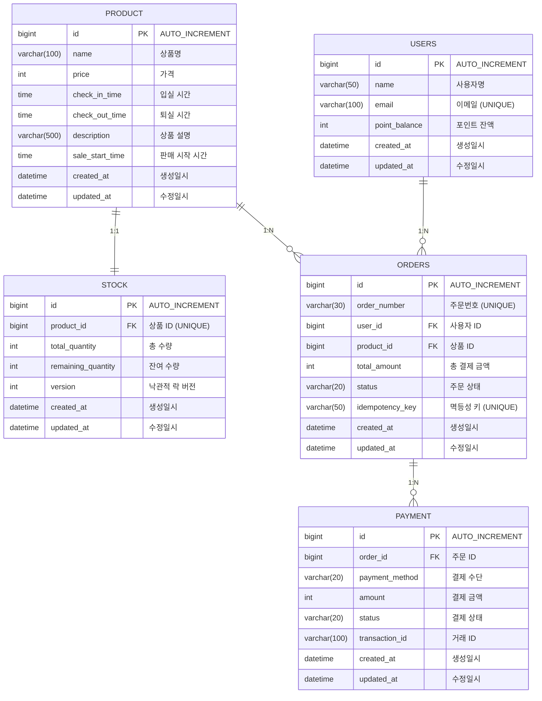

# ERD (Entity Relationship Diagram)

## 테이블 관계도



---

## 테이블 상세 설명

### PRODUCT (상품)

| 컬럼 | 타입 | 제약조건 | 설명 |
|------|------|---------|------|
| id | BIGINT | PK, AUTO_INCREMENT | 상품 ID |
| name | VARCHAR(100) | NOT NULL | 상품명 |
| price | INT | NOT NULL | 가격 |
| check_in_time | TIME | NOT NULL | 입실 시간 |
| check_out_time | TIME | NOT NULL | 퇴실 시간 |
| description | VARCHAR(500) | | 상품 설명 |
| sale_start_time | TIME | NOT NULL, DEFAULT '00:00:00' | 판매 시작 시간 |
| created_at | DATETIME | NOT NULL | 생성일시 |
| updated_at | DATETIME | NOT NULL | 수정일시 |

### STOCK (재고)

| 컬럼 | 타입 | 제약조건 | 설명 |
|------|------|---------|------|
| id | BIGINT | PK, AUTO_INCREMENT | 재고 ID |
| product_id | BIGINT | FK, UNIQUE, NOT NULL | 상품 ID |
| total_quantity | INT | NOT NULL | 총 수량 |
| remaining_quantity | INT | NOT NULL | 잔여 수량 |
| version | INT | NOT NULL, DEFAULT 0 | 낙관적 락 버전 (Redis Fallback 시 사용) |
| created_at | DATETIME | NOT NULL | 생성일시 |
| updated_at | DATETIME | NOT NULL | 수정일시 |

### USERS (사용자)

| 컬럼 | 타입 | 제약조건 | 설명 |
|------|------|---------|------|
| id | BIGINT | PK, AUTO_INCREMENT | 사용자 ID |
| name | VARCHAR(50) | NOT NULL | 사용자명 |
| email | VARCHAR(100) | UNIQUE, NOT NULL | 이메일 |
| point_balance | INT | NOT NULL, DEFAULT 0 | 포인트 잔액 |
| created_at | DATETIME | NOT NULL | 생성일시 |
| updated_at | DATETIME | NOT NULL | 수정일시 |

### ORDERS (주문)

| 컬럼 | 타입 | 제약조건 | 설명 |
|------|------|---------|------|
| id | BIGINT | PK, AUTO_INCREMENT | 주문 ID |
| order_number | VARCHAR(30) | UNIQUE, NOT NULL | 주문번호 |
| user_id | BIGINT | FK, NOT NULL | 사용자 ID |
| product_id | BIGINT | FK, NOT NULL | 상품 ID |
| total_amount | INT | NOT NULL | 총 결제 금액 |
| status | VARCHAR(20) | NOT NULL | 주문 상태 (PENDING/COMPLETED/FAILED/CANCELLED) |
| idempotency_key | VARCHAR(50) | UNIQUE, NOT NULL | 멱등성 키 |
| created_at | DATETIME | NOT NULL | 생성일시 |
| updated_at | DATETIME | NOT NULL | 수정일시 |

### PAYMENT (결제)

| 컬럼 | 타입 | 제약조건 | 설명 |
|------|------|---------|------|
| id | BIGINT | PK, AUTO_INCREMENT | 결제 ID |
| order_id | BIGINT | FK, NOT NULL | 주문 ID |
| payment_method | VARCHAR(20) | NOT NULL | 결제 수단 (CREDIT_CARD/Y_PAY/Y_POINT) |
| amount | INT | NOT NULL | 결제 금액 |
| status | VARCHAR(20) | NOT NULL | 결제 상태 (PENDING/APPROVED/FAILED/CANCELLED) |
| transaction_id | VARCHAR(100) | | 거래 ID |
| created_at | DATETIME | NOT NULL | 생성일시 |
| updated_at | DATETIME | NOT NULL | 수정일시 |

---

## DDL 스크립트

```sql
CREATE TABLE product (
    id BIGINT AUTO_INCREMENT PRIMARY KEY,
    name VARCHAR(100) NOT NULL,
    price INT NOT NULL,
    check_in_time TIME NOT NULL,
    check_out_time TIME NOT NULL,
    description VARCHAR(500),
    sale_start_time TIME NOT NULL DEFAULT '00:00:00',
    created_at DATETIME NOT NULL DEFAULT CURRENT_TIMESTAMP,
    updated_at DATETIME NOT NULL DEFAULT CURRENT_TIMESTAMP ON UPDATE CURRENT_TIMESTAMP
);

CREATE TABLE stock (
    id BIGINT AUTO_INCREMENT PRIMARY KEY,
    product_id BIGINT NOT NULL UNIQUE,
    total_quantity INT NOT NULL,
    remaining_quantity INT NOT NULL,
    version INT NOT NULL DEFAULT 0,
    created_at DATETIME NOT NULL DEFAULT CURRENT_TIMESTAMP,
    updated_at DATETIME NOT NULL DEFAULT CURRENT_TIMESTAMP ON UPDATE CURRENT_TIMESTAMP,
    CONSTRAINT fk_stock_product FOREIGN KEY (product_id) REFERENCES product (id)
);

CREATE TABLE users (
    id BIGINT AUTO_INCREMENT PRIMARY KEY,
    name VARCHAR(50) NOT NULL,
    email VARCHAR(100) NOT NULL UNIQUE,
    point_balance INT NOT NULL DEFAULT 0,
    created_at DATETIME NOT NULL DEFAULT CURRENT_TIMESTAMP,
    updated_at DATETIME NOT NULL DEFAULT CURRENT_TIMESTAMP ON UPDATE CURRENT_TIMESTAMP
);

CREATE TABLE orders (
    id BIGINT AUTO_INCREMENT PRIMARY KEY,
    order_number VARCHAR(30) NOT NULL UNIQUE,
    user_id BIGINT NOT NULL,
    product_id BIGINT NOT NULL,
    total_amount INT NOT NULL,
    status VARCHAR(20) NOT NULL,
    idempotency_key VARCHAR(50) NOT NULL UNIQUE,
    created_at DATETIME NOT NULL DEFAULT CURRENT_TIMESTAMP,
    updated_at DATETIME NOT NULL DEFAULT CURRENT_TIMESTAMP ON UPDATE CURRENT_TIMESTAMP,
    CONSTRAINT fk_orders_user FOREIGN KEY (user_id) REFERENCES users (id),
    CONSTRAINT fk_orders_product FOREIGN KEY (product_id) REFERENCES product (id),
    INDEX idx_orders_user_id (user_id),
    INDEX idx_orders_idempotency_key (idempotency_key)
);

CREATE TABLE payment (
    id BIGINT AUTO_INCREMENT PRIMARY KEY,
    order_id BIGINT NOT NULL,
    payment_method VARCHAR(20) NOT NULL,
    amount INT NOT NULL,
    status VARCHAR(20) NOT NULL,
    transaction_id VARCHAR(100),
    created_at DATETIME NOT NULL DEFAULT CURRENT_TIMESTAMP,
    updated_at DATETIME NOT NULL DEFAULT CURRENT_TIMESTAMP ON UPDATE CURRENT_TIMESTAMP,
    CONSTRAINT fk_payment_order FOREIGN KEY (order_id) REFERENCES orders (id),
    INDEX idx_payment_order_id (order_id)
);
```

---

## 인덱스 설계

| 테이블 | 인덱스 | 컬럼 | 사유 |
|--------|--------|------|------|
| stock | UQ (product_id) | product_id | 상품당 재고 1건 보장 |
| users | UQ (email) | email | 이메일 중복 방지 |
| orders | UQ (order_number) | order_number | 주문번호 유일성 |
| orders | UQ (idempotency_key) | idempotency_key | 멱등성 키 유일성 (Redis Fallback 시 DB 기반 중복 체크) |
| orders | IDX (user_id) | user_id | 사용자별 주문 조회 |
| payment | IDX (order_id) | order_id | 주문별 결제 내역 조회 |
