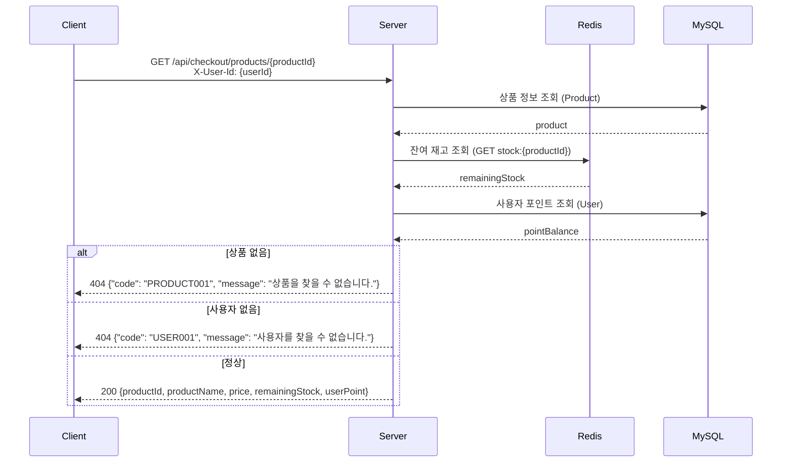
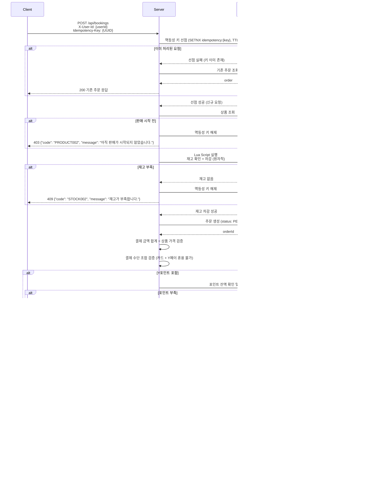
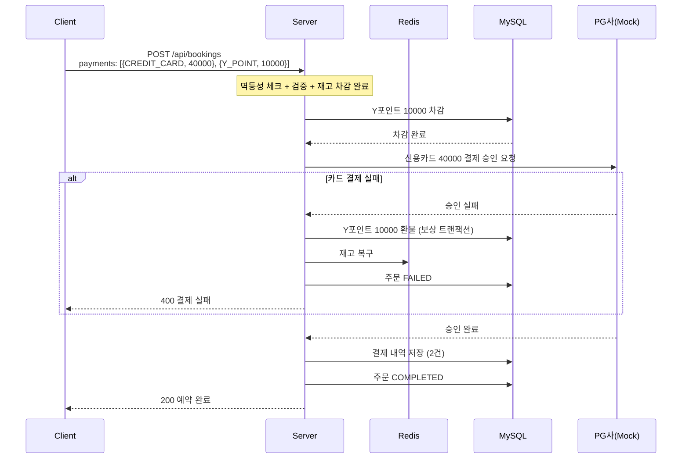
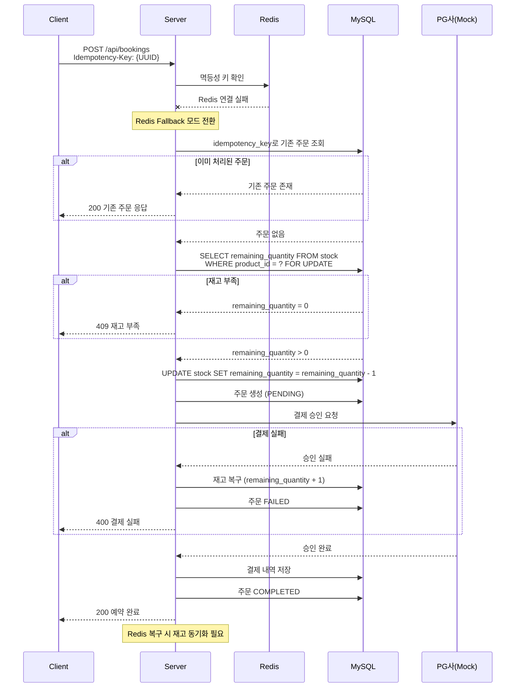
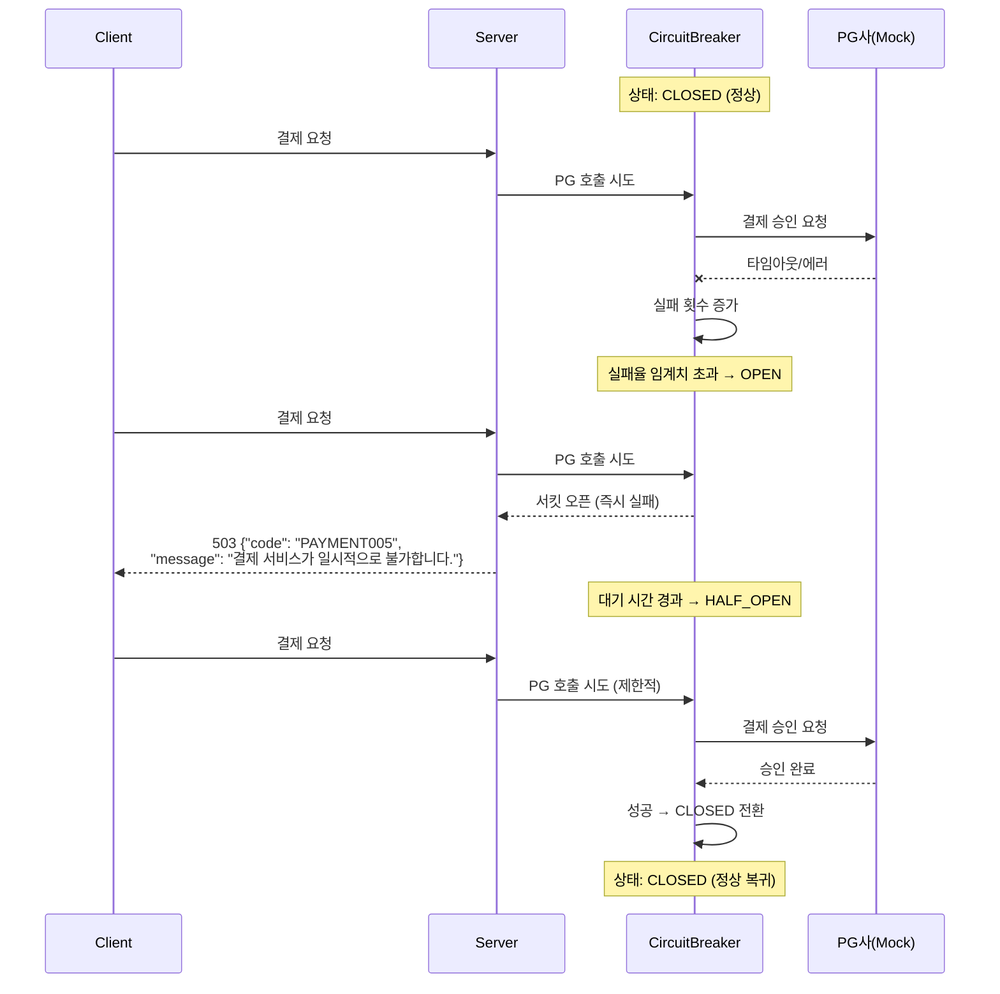

# 시퀀스 다이어그램

## 1. Checkout API 플로우

```mermaid
sequenceDiagram
    participant C as Client
    participant S as Server
    participant R as Redis
    participant DB as MySQL

    C->>S: GET /api/checkout/products/{productId}<br/>X-User-Id: {userId}

    S->>DB: 상품 정보 조회 (Product)
    DB-->>S: product
    S->>R: 잔여 재고 조회 (GET stock:{productId})
    R-->>S: remainingStock
    S->>DB: 사용자 포인트 조회 (User)
    DB-->>S: pointBalance

    alt 상품 없음
        S-->>C: 404 {"code": "PRODUCT001", "message": "상품을 찾을 수 없습니다."}
    else 사용자 없음
        S-->>C: 404 {"code": "USER001", "message": "사용자를 찾을 수 없습니다."}
    else 정상
        S-->>C: 200 {productId, productName, price, remainingStock, userPoint}
    end
```

---

## 2. Booking API 플로우 (정상 케이스)

```mermaid
sequenceDiagram
    participant C as Client
    participant S as Server
    participant R as Redis
    participant DB as MySQL
    participant PG as PG사(Mock)

    C->>S: POST /api/bookings<br/>X-User-Id: {userId}<br/>Idempotency-Key: {UUID}

    %% Step 1: 멱등성 체크 (SETNX)
    S->>R: 멱등성 키 선점 (SETNX idempotency:{key}, TTL 24h)
    alt 이미 처리된 요청
        R-->>S: 선점 실패 (키 이미 존재)
        S->>DB: 기존 주문 조회
        DB-->>S: order
        S-->>C: 200 기존 주문 응답
    end
    R-->>S: 선점 성공 (신규 요청)

    %% Step 2: 오픈 시간 검증
    S->>DB: 상품 조회
    alt 판매 시작 전
        S->>R: 멱등성 키 해제
        S-->>C: 403 {"code": "PRODUCT002", "message": "아직 판매가 시작되지 않았습니다."}
    end

    %% Step 3: 재고 차감 (Redis Lua Script)
    S->>R: Lua Script 실행<br/>재고 확인 + 차감 (원자적)
    alt 재고 부족
        R-->>S: 재고 없음
        S->>R: 멱등성 키 해제
        S-->>C: 409 {"code": "STOCK002", "message": "재고가 부족합니다."}
    end
    R-->>S: 재고 차감 성공

    %% Step 4: 주문 생성
    S->>DB: 주문 생성 (status: PENDING)
    DB-->>S: orderId

    %% Step 5: 결제 검증 및 처리
    S->>S: 결제 금액 합계 = 상품 가격 검증
    S->>S: 결제 수단 조합 검증 (카드 + Y페이 혼용 불가)

    alt Y포인트 포함
        S->>DB: 포인트 잔액 확인 및 차감
        alt 포인트 부족
            S->>R: 재고 복구 (INCR)
            S->>DB: 주문 상태 변경 (FAILED)
            S-->>C: 400 {"code": "PAYMENT004", "message": "포인트가 부족합니다."}
        end
    end

    alt 신용카드 or Y페이
        S->>PG: 결제 승인 요청
        alt 결제 실패 (한도 초과 등)
            PG-->>S: 승인 실패
            S->>DB: 포인트 환불 (포인트 사용 시)
            S->>R: 재고 복구 (INCR)
            S->>DB: 주문 상태 변경 (FAILED)
            S-->>C: 400 {"code": "PAYMENT003", "message": "결제 승인에 실패했습니다."}
        end
        PG-->>S: 승인 완료 (transactionId)
    end

    %% Step 6: 주문 확정
    S->>DB: 결제 내역 저장
    S->>DB: 주문 상태 변경 (COMPLETED)
    S->>DB: DB 재고 차감

    S-->>C: 200 {orderId, orderNumber, totalAmount, orderStatus, payments}
```

---

## 3. Booking API 플로우 (복합 결제 - 카드 + 포인트)

```mermaid
sequenceDiagram
    participant C as Client
    participant S as Server
    participant R as Redis
    participant DB as MySQL
    participant PG as PG사(Mock)

    C->>S: POST /api/bookings<br/>payments: [{CREDIT_CARD, 40000}, {Y_POINT, 10000}]

    Note over S: 멱등성 체크 + 검증 + 재고 차감 완료

    %% 포인트 먼저 차감
    S->>DB: Y포인트 10000 차감
    DB-->>S: 차감 완료

    %% 카드 결제
    S->>PG: 신용카드 40000 결제 승인 요청
    alt 카드 결제 실패
        PG-->>S: 승인 실패
        S->>DB: Y포인트 10000 환불 (보상 트랜잭션)
        S->>R: 재고 복구
        S->>DB: 주문 FAILED
        S-->>C: 400 결제 실패
    end
    PG-->>S: 승인 완료

    S->>DB: 결제 내역 저장 (2건)
    S->>DB: 주문 COMPLETED
    S-->>C: 200 예약 완료
```

---

## 4. 장애 발생 시 플로우 (Redis 장애)

```mermaid
sequenceDiagram
    participant C as Client
    participant S as Server
    participant R as Redis
    participant DB as MySQL
    participant PG as PG사(Mock)

    C->>S: POST /api/bookings<br/>Idempotency-Key: {UUID}

    %% Redis 장애 감지
    S->>R: 멱등성 키 확인
    R--xS: Redis 연결 실패

    Note over S: Redis Fallback 모드 전환

    %% DB 기반 멱등성 체크
    S->>DB: idempotency_key로 기존 주문 조회
    alt 이미 처리된 주문
        DB-->>S: 기존 주문 존재
        S-->>C: 200 기존 주문 응답
    end
    DB-->>S: 주문 없음

    %% DB 비관적 락으로 재고 차감
    S->>DB: SELECT remaining_quantity FROM stock<br/>WHERE product_id = ? FOR UPDATE
    alt 재고 부족
        DB-->>S: remaining_quantity = 0
        S-->>C: 409 재고 부족
    end
    DB-->>S: remaining_quantity > 0

    S->>DB: UPDATE stock SET remaining_quantity = remaining_quantity - 1
    S->>DB: 주문 생성 (PENDING)

    %% 결제 처리 (정상 플로우와 동일)
    S->>PG: 결제 승인 요청
    alt 결제 실패
        PG-->>S: 승인 실패
        S->>DB: 재고 복구 (remaining_quantity + 1)
        S->>DB: 주문 FAILED
        S-->>C: 400 결제 실패
    end
    PG-->>S: 승인 완료

    S->>DB: 결제 내역 저장
    S->>DB: 주문 COMPLETED
    S-->>C: 200 예약 완료

    Note over S: Redis 복구 시 재고 동기화 필요
```

---

## 5. 서킷브레이커 동작 플로우

```mermaid
sequenceDiagram
    participant C as Client
    participant S as Server
    participant CB as CircuitBreaker
    participant PG as PG사(Mock)

    Note over CB: 상태: CLOSED (정상)

    C->>S: 결제 요청
    S->>CB: PG 호출 시도
    CB->>PG: 결제 승인 요청
    PG--xCB: 타임아웃/에러
    CB->>CB: 실패 횟수 증가

    Note over CB: 실패율 임계치 초과 → OPEN

    C->>S: 결제 요청
    S->>CB: PG 호출 시도
    CB-->>S: 서킷 오픈 (즉시 실패)
    S-->>C: 503 {"code": "PAYMENT005",<br/>"message": "결제 서비스가 일시적으로 불가합니다."}

    Note over CB: 대기 시간 경과 → HALF_OPEN

    C->>S: 결제 요청
    S->>CB: PG 호출 시도 (제한적)
    CB->>PG: 결제 승인 요청
    PG-->>CB: 승인 완료
    CB->>CB: 성공 → CLOSED 전환

    Note over CB: 상태: CLOSED (정상 복귀)
```
